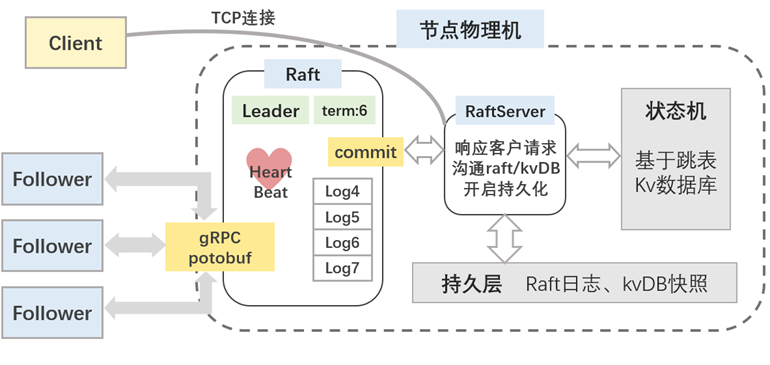

# raft_kvDB
```
.
├── bin 生成的可执行文件存放地
├── cmake-build-debug 项目编译目录
├── lib  项目编译后的库文件存放地
├── src 项目源代码存放地，按照子模块组织
│   ├── common  子模块共用的，一般是一些util，日志，配置文件
│   ├── fiber  协程相关代码
│   ├── raftClerk raft客户端代码
│   ├── raftCore raft核心代码
│   ├── raftRpcPro raft中rpc涉及的protoc文件
│   └── skipList 跳表（上层状态机）相关代码
└── run.cpp  测试代码
```

主题架构如下

raft实现参照raft论文（未实现集群成员变更）

RPC采用gRPC

kvDB采用skipList


